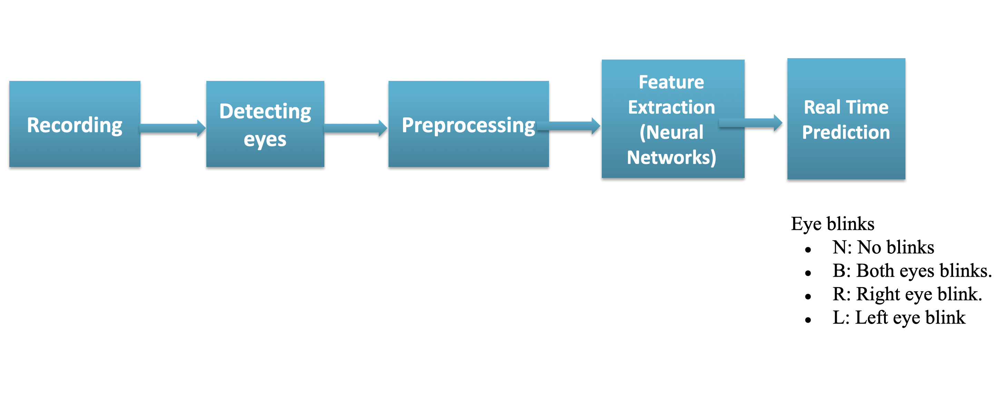

# Eye Controle using Deep Learning

This project proposes a hybrid model combining a Convolutional Neural Network (CNN) and a Recurrent Neural Network (RNN) to detect eye motions,
which can be utilized for controlling devices. The proposed method was validated through the development of a real-time vision system capable of performing face detection,
eye detection, and classification of four distinct eye motions: No Eye Blinking, Both Eyes Blinking, Left Eye Blinking, and Right Eye Blinking.

To achieve this,  a custom dataset was constructed using a webcam. The data preparation process included capturing image frames,
detecting faces and eyes using HAAR cascades, preprocessing the raw images, resizing them, and combining the frames into videos that captured the eye motions.
Each dataset sample consisted of two videos: one for the left eye and one for the right eye.

The model was developed by testing and refining various algorithms until optimal results were achieved. A key innovation was the application of the Attention mechanism to video frames,
where different weights were assigned to frames based on their relevance. This ensured that irrelevant frames, which contained no motion, were effectively ignored, resulting in a significant improvement in accuracy.
The final model achieved an accuracy of 96%.

The dataset initially consisted of approximately 30 samples per motion (120 samples in total). Through augmentation—using custom code to rotate video frames by predefined angles
and recombine them, the dataset was expanded to around 600 samples. While the current dataset proved sufficient for high-accuracy classification,
future improvements could be achieved by increasing the dataset size to at least 100 samples per motion.

Finally, a real-time detection system was implemented. This system captures frames from a live camera feed,
detects faces, identifies eyes, and classifies eye motions in real time using the trained model. 
This solution can be further customized to trigger specific actions based on the detected motion, offering potential applications in device control and human-computer interaction.

# Structure

